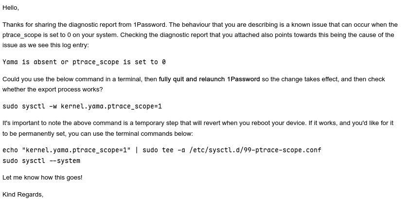

如题，在我的机器debain13上，1password客户端的数据导出有个问题：导出的时候没有发生任何事情，连保存文件在哪都没有显示。经过向1password support团队的求助得出以下解决方案

```bash
# 临时
sudo sysctl -w kernel.yama.ptrace_scope=1
# 然后重启1password客户端

# 永久设置
# echo "kernel.yama.ptrace_scope=1" | sudo tee -a /etc/sysctl.d/99-ptrace-scope.conf
# sudo sysctl --system
# 然后重启1password客户端
```

邮件原文如下图


