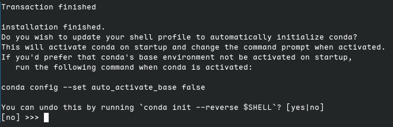

# 我的debian环境+KDE的配置

debian是一个自由操作系统，又被称做Debian GNU/linux，官网是[https://debian.org](https://debian.org)。本贴持续更新哈。

~~有时简直想告诉读者，快点使用搜索引擎吧，这不比我的破教程香~~

## 换源

`DEB882格式`：适用于debian12及以上。目前稳定版是Debian13（Trixie）

```
# /etc/apt/sources.list.d/debian.sources
Types: deb
URIs: http://mirror.nju.edu.cn/debian/
Suites: trixie trixie-updates
Components: main contrib non-free non-free-firmware
Signed-By: /usr/share/keyrings/debian-archive-keyring.gpg

# Types: deb
# URIs: http://security.debian.org/debian-security
# Suites: trixie-security
# Components: main contrib non-free non-free-firmware
# Signed-By: /usr/share/keyrings/debian-archive-keyring.gpg
```

:::note
换源后记得升级包哦

`sudo apt update && sudo apt upgrade`升级包
:::

:::note
**升级系统版本到测试版的方法**

1. 换源至测试版
2. 最小更新 `sudo apt upgrade --without-new-pkgs`
3. 重启
4. 中等更新 `sudo apt upgrade`
5. 重启
6. 全面更新 `sudo apt full-upgrade`
7. 重启， `sudo apt update && sudo apt upgrade`

:::

## 常用下载

```bash
sudo apt install wget curl vim htop font-manager tlp tlp-rdw 
# tlp 电池优化
# ThinkPad 需要一些附加软件包。
# sudo apt install tp-smapi-dkms acpi-call-dkms
```

- 下载截图工具:[snipaste](https://zh.snipaste.com/)，不过KDE自带的spectacle功能也挺好用的

- Chrome浏览器：(速度竟然还挺快)

```bash
# 获取GPG验证密钥
curl -fSsL https://dl.google.com/linux/linux_signing_key.pub | sudo gpg --dearmor | sudo tee /usr/share/keyrings/google-chrome.gpg >> /dev/null
# 添加google-chrome仓库
echo "deb [arch=amd64 signed-by=/usr/share/keyrings/google-chrome.gpg] http://dl.google.com/linux/chrome/deb/ stable main" | sudo tee /etc/apt/sources.list.d/google-chrome.list
# 安装
sudo apt update && sudo apt install -y google-chrome-stable
```

## 输入法

```bash
sudo apt install fcitx5 fcitx5-chinese-addons fcitx5-rime
```

词库使用[雾凇拼音](https://github.com/iDvel/rime-ice)，下载仓库解压到`~/.local/share/fcitx5/rime`下，即可使用，或使用git。

```bash
cd ~/.local/share/fcitx5
# 这里我用的是我自己的仓库
git clone git@github.com:yjdyamv/rime-ice.git rime --depth 1
# 这个是原仓库
# git clone https://github.com/iDvel/rime-ice.git rime --depth 1
# 更新
cd rime
git pull
```

:::note
**防止在vscode里用不了中文**

环境设置,在位置`/etc/environment`输入以下内容，参考了此[博客帖子](https://blog.dimeta.top/archives/kdexia-shu-ru-fa-pei-zhi-de-xiao-xi-jie)

```plaintext
#
# This file is parsed by pam_env module
#
# Syntax: simple "KEY=VAL" pairs on separate lines
#
XIM=fcitx5
XIM_PROGRAM=fcitx5
GTK_IM_MODULE=fcitx5
QT_IM_MODULE=fcitx5
XMODIFIERS=@im=fcitx5
SDL_IM_MODULE=fcitx5
GLFW_IM_MODULE=fcitx5
```

:::

## flatpak

- 安装：

```bash
# 安装Flatpak
sudo apt install -y flatpak
# 安装Flatpak的KDE plasma扩展
sudo apt install -y plasma-discover-backend-flatpak
# 添加官方仓库
flatpak remote-add --if-not-exists flathub https://dl.flathub.org/repo/flathub.flatpakrepo
```

- 换源：

```bash
sudo flatpak remote-modify flathub --url=https://mirrors.ustc.edu.cn/flathub
```

- 下载所需软件

```bash
# 下载Firefox
flatpak install flathub org.mozilla.firefox
```

```bash
# 下载matrix客户端
flatpak install flathub im.fluffychat.Fluffychat
```

```bash
# 下载localsend
flatpak install flathub org.localsend.localsend_app
```

其他的就不列举了

## 代理

咳咳，就放个[clash verge rev](https://www.clashverge.dev/)的官网在这吧 [https://www.clashverge.dev/](https://www.clashverge.dev/)，GitHub仓库地址是[https://github.com/clash-verge-rev/clash-verge-rev](https://github.com/clash-verge-rev/clash-verge-rev)。订阅链接就自己去找吧 （狡黠）

## 终端美化

- zsh:

```bash
sudo apt install zsh
```

- 安装[oh-my-zsh](https://ohmyz.sh/)

```bash
sh -c "$(curl -fsSL https://raw.githubusercontent.com/ohmyzsh/ohmyzsh/master/tools/install.sh)"
```

- 安装zsh主题[powerlevel10k](https://github.com/romkatv/powerlevel10k)

```bash
git clone --depth=1 https://github.com/romkatv/powerlevel10k.git ${ZSH_CUSTOM:-$HOME/.oh-my-zsh/custom}/themes/powerlevel10k
```

`~/.zshrc`里`ZSH_THEME="..."`修改为：`ZSH_THEME="powerlevel10k/powerlevel10k"`

- 安装插件zsh-autosuggestions和zsh-syntax-highlighting

```bash
git clone https://github.com/zsh-users/zsh-autosuggestions.git ${ZSH_CUSTOM:-~/.oh-my-zsh/custom}/plugins/zsh-autosuggestions
git clone https://github.com/zsh-users/zsh-syntax-highlighting.git ${ZSH_CUSTOM:-~/.oh-my-zsh/custom}/plugins/zsh-syntax-highlighting
```

在`~/.zshrc`里将plugins项改为如下以启用扩展。`z`、`extract`、`web-search`均为内置插件。

```plaintext
plugins=(git zsh-autosuggestions zsh-syntax-highlighting z extract web-search)
```

注：

- `extract`：`x asdf.tar.gz`可以方便解压，无需了解后缀。
- `z`：`z dir`即可到达曾经去过的dir文件夹下
- `web-search`：`bing zsh是什么`可在终端中直接搜索

## 开发环境

下载 [vscode](https://code.visualstudio.com/)

**不要添加vscode仓库**到`/etc/apt/sources.list.d/vscode.list`，国内网络用此仓库更新下载会很慢。

下载插件: `clangd`, `ms-python`, `pylance`, `xmake`，`rust-analyzer`，`remote-ssh(code)/open remote-ssh(codium)`等。

:::note
**可以登陆github账户以同步`setting.json`及插件。**
:::

### c/cpp

- gcc、clang工具链及clangd语法分析与代码提示工具

```bash
sudo apt install build-essential clang clangd
```

- 构建工具

```bash
sudo apt install xmake cmake meson
```

:::note
`xmake`在`trixie（debian13）`及以后可以直接`sudo apt install xmake`安装
:::

### python

1. 下载并安装[miniforge](https://mirrors.nju.edu.cn/github-release/conda-forge/miniforge/)

:::note
注意此处不要手快回车了，输入`yes`来进行`conda init`。目的是将设置环境变量及conda环境激活脚本终端在打开时执行。

要是回车了也有补救办法：

```bash
~/miniforge3/bin/conda init zsh $$ ~/miniforge3/bin/mamba shell init
```

:::

2. conda换源：
`conda config --set show_channel_urls yes`来生成`.condarc`,其内容修改为如下。

```
# ~/.condarc
channels:
    - defaults
show_channel_urls: true
default_channels:
    - https://mirror.nju.edu.cn/anaconda/pkgs/main
    - https://mirror.nju.edu.cn/anaconda/pkgs/r
    - https://mirror.nju.edu.cn/anaconda/pkgs/msys2
custom_channels:
    conda-forge: https://mirror.nju.edu.cn/anaconda/cloud
    pytorch: https://mirror.nju.edu.cn/anaconda/cloud
```

3. pypi换源：

```bash
python -m pip install -i https://mirror.nju.edu.cn/pypi/web/simple --upgrade pip
pip config set global.index-url https://mirror.nju.edu.cn/pypi/web/simple
```

### rust

1. 将以下内容加入`.zshrc`，随后自行执行`source ~/.zshrc`

```bash
export RUSTUP_DIST_SERVER=https://mirror.nju.edu.cn/rustup
export RUSTUP_UPDATE_ROOT=https://mirror.nju.edu.cn/rustup/rustup
```

2. 使用官方脚本下载安装Rust

```bash
curl --proto '=https' --tlsv1.2 -sSf https://sh.rustup.rs | sh
```

:::note
debian13以上可以直接`sudo apt install rustup`，然后使用`rustup install stable`来下载工具链
:::

### nodejs

- 使用[`volta`](https://volta.sh/)(推荐,速度快)：
  - 安装volta

```bash
curl https://get.volta.sh | bash 
```

- volta换源：修改`~/.volta/hooks.json`

```plaintext
# ~/.volta/hooks.json
{
"node": {
    "index": {
        "template": "https://mirror.nju.edu.cn/nodejs-release/index.json"
        },
        "distro": {
            "template": "https://mirror.nju.edu.cn/nodejs-release/v{{version}}/{{filename}}"
        }
    }
}
```

- 安装node `volta install node`
- 安装pnpm、yarn等包管理 `volta install corepack`
- npm换源：使用淘宝源

```bash
npm config set registry https://registry.npmmirror.com
```

## git global

### ssh密钥

我保存在`Bitwarden`里了哈。直接复制到`~/.ssh/id_25519`和`~/.ssh/id_25519.pub`就行。

:::note
提一嘴哈，也可以使用`ssh-keygen -t ed25519`命令。ed25519的好处是公钥短，计算快，强度也不低，大致相当于rsa3072位的强度，并且大多的git仓库服务基本都支持此算法，如[github](https://github.com)、[gitea](https://gitea.com)、[gitlab](https://gitlab.com)等。如果想换用RSA算法可以使用此命令`ssh-keygen -t rsa`加上`-b 4096`可以指定4096位数，ed25519就不用指定位数了（其实也指定不了，因为定死了）。

ed25519算法在OpenSSH 6.5 时引入，在 9.5 时成为默认算法，此前RSA为默认算法。有些机器系统可能很老，OpenSSH版本低则可能不支持ed25519，这时就得用RSA密钥了。RSA可以调整密钥位数，ed25519不能。RSA已经有对应的量子算法破解（不过这得等待量子计算机建设的发展了，现在的量子计算机还没有多少量子比特）。RSA的好处是兼容性好、灵活性好，但安全性有所降低。
:::

### username & email

```bash
git config --global user.name "your-username"
git config --global user.email "your-email-address"
```

### 代理(ssh)

`sudo apt install corkscrew`

编辑此文件`~/.ssh/config`

```plaintext
# ~/.ssh/config

Host github.com
    User git
    ProxyCommand corkscrew 127.0.0.1 7897 %h %p
    IdentityFile ~/.ssh/id_ed25519-github
```

此方式来自于[stackoverflow](https://stackoverflow.com)的一个[问答](https://stackoverflow.com/questions/19161960/connect-with-ssh-through-a-proxy)

## 感谢

感谢[ustc源的帮助文档](https://github.com/ustclug/mirrorhelp)及[校园网联合镜像站的帮助文档](https://github.com/mirrorz-org/mirrorz-help)

感谢[ustc mirror](https://mirrors.ustc.edu.cn/)、[nju mirror](https://mirror.nju.edu.cn/)及[校园网联合镜像站](https://help.mirrors.cernet.edu.cn/)对于中国开源社区的贡献。

感谢LCPU的公开课程——[LCPU Getting Started](https://github.com/lcpu-club/getting-started),此课程对我帮助很大，使我受益良多。
