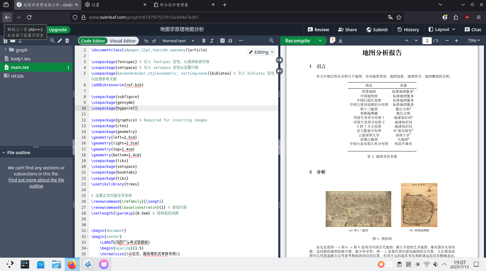
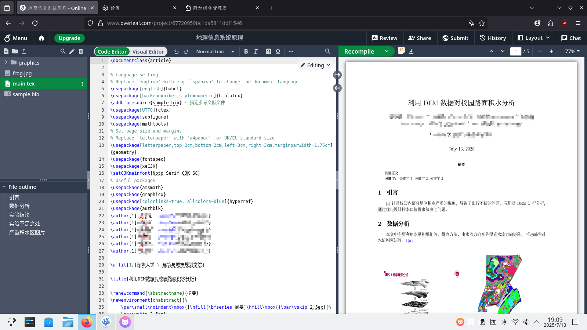

# 我使用typst的经历

## 初始
大约一年前，我看着同学的报告如此美观，标题、参考文献、关键词，这一切都是这么赏心悦目（正式），“这格式是真的漂亮啊”，随后想到了之前大计老师提过一嘴的LaTex，正巧图书馆培训也有关于科研写作的培训，就去学了下，之后也在后一学期的课程报告的文档上也用上了，就是那个最经典的article类，别说还怪正式的。

这对我的信心有着极大的增强，可是正当我想要为我校做一个本科生毕业论文模板的时候，傻眼了：
- 各种包、宏，不知道哪个宏是哪个包里面的
- “\”乱飞，眼花缭乱
- 看其他高校（THU）的代码，没有注释
- 本地环境难以配置，极其的重（tex-live.img5个GB的安装包啊）
- 不知道包的文档在哪
- 没有好的社群指导自己
- bib有好几个宏包

面对如此困境，险些绝望：我还能把模板做出来吗？前人也不是没写过本校的本科论文模板，但那个模板解耦性过低，而研究生论文模板的解耦性就很好，但看不懂，哈哈。

直到NJU-LUG(NJU LINUX USER GROUP)群里看到了typst才看到了希望

## 初识typst

LUG群里有位大佬——[OrangeX4](https://github.com/OrangeX4) (之后就知道他为啥是大佬了)，我在搜索typst后看到了方橙大大写的[知乎文章](https://zhuanlan.zhihu.com/p/669097092),其中对typst的使用体验进行了描述，其中对typst进行了客观详实的描述，尤其是这几点很吸引我：

- typst编译快，基本相当实时预览
- typst有包管理，本地开发无需下载所有包（说的就是你，texlive）
- typst报错可读性好，latex的报错可读性差
- 现代的编程语言，latex是宏语言
- 制作模板的能力强

随后迫不及待地投入typst的学习中，又看了方橙大大写的[typst-talk](https://github.com/OrangeX4/typst-talk)，“哇，原来他还是touying和pinit包的作者，也是modern-nju-thesis的作者，大佬啊”。后来我的modern-szu-thesis的框架就是按照modern-nju-thesis来的。后来还去加了“typst中文非官方群聊”和typst官方的discord。群里面的大佬都很热情，问问题都有人解答，“在这个群即便不说话也能学到很多”，有些自己不会实现的问问群友基本都能解决。官方文档和群内大佬建设的faq是很好的参考资料。“群友科技”造福大家，像[纸夜姐姐](https://github.com/Myriad-Dreamin)的[tinymist](https://github.com/Myriad-Dreamin/tinymist)，群主的[typst_preview](https://github.com/Enter-tainer/typst-preview) (现已经合并至tinymist里)，方橙大大的[touying](https://github.com/touying-typ/touying)和[modern-nju-thesis](https://github.com/nju-lug/modern-nju-thesis)。如同扎猛子一样学习了起来。

## 进步、欢喜

搓了一个寒假，终于争取在开学前把我的包[modern-szu-thesis](https://github.com/yjdyamv/modern-szu-thesis)的发布了，第一次在github上做pr还是很激动的。

肝了几周又把研究生部分的完成了，爽。

平时有些科目要交报告，上面会有数学公式要写，用typst写数学公式，爽。

期末要做poster，在[universe]()里选了[peace-of-poster](https://typst.app/universe/package/peace-of-posters)做模板，迅速完成了，爽，还有另一门课要交实验报告，诶恰好，universe上有，爽。

期末完了，迅速用touying的自带主题改了一个本校的slides模板，爽。

在LCPU Getting Started里的第十二节的关于latex的安装和typst部分的资料由我推荐，由LCPU成员完成撰写，我参与code review,激动！还帮忙在typst-talk里修了些过时内容，爽。

**不止于此，不限于此！**
