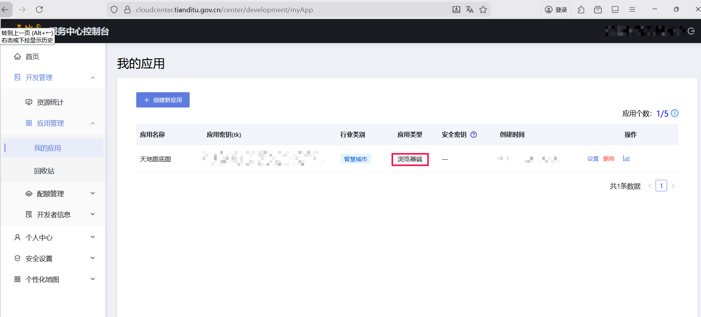

qgis是一个开源的GIS工具（也是最主流的），近来在做课程作业的使用用到了，**功能很完善，插件很多**。果真做项目是学的最快的。

## 下载安装

可以去[官网](https:://download.qgis.org)下载，但下载的比较慢，可以去南大镜像的[qgis](https://mirror.nju.edu.cn/qgis/)下载(嘿嘿，是我提得issue哦，南大镜像站nb)

## 推荐插件

- [天地图](https://plugins.qgis.org/plugins/tianditu-tools/): 可以方便的导入地图底图，包括天地图、esri、谷歌地图、高德地图等地图。其中天地图需要api key，自行去[天地图控制台](http://lbs.tianditu.gov.cn/)获取。

- [Semi-Automatic Classification Plugin](https://plugins.qgis.org/plugins/SemiAutomaticClassificationPlugin/): 这个插件可以进行遥感影像的预处理和分类的操作。下载提供Landsat, Sentinel-2等。

嘿嘿，其他的后续再写吧 ~~其实是我主要也就用这俩~~

## 常见使用

哎，常见使用也挺多的，要根据项目要求来做，比如分级设色图、土地分类图、表转shape、栅格裁剪等。具体操作可以自行搜索或问ai。暂时先写到这了。
