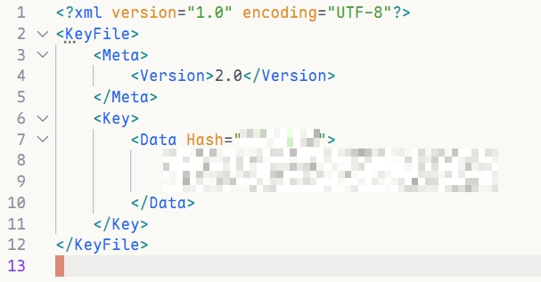
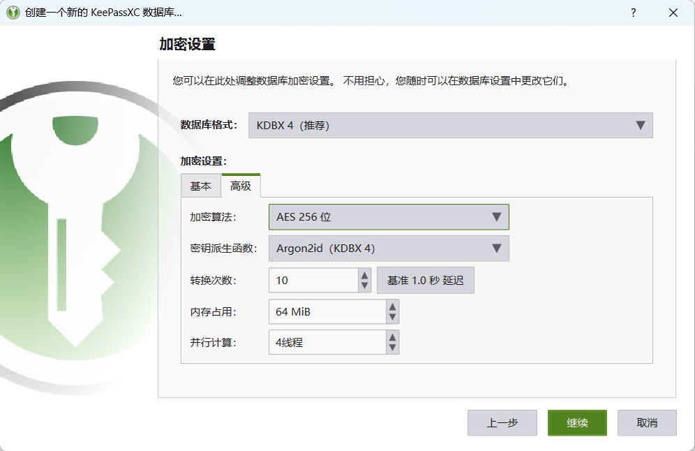
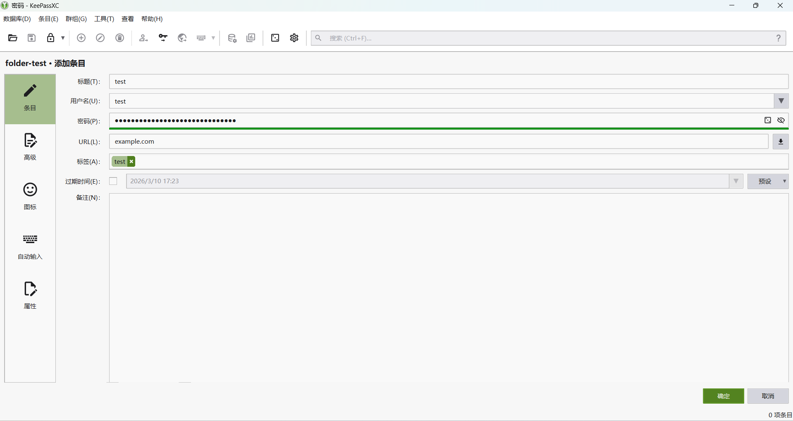
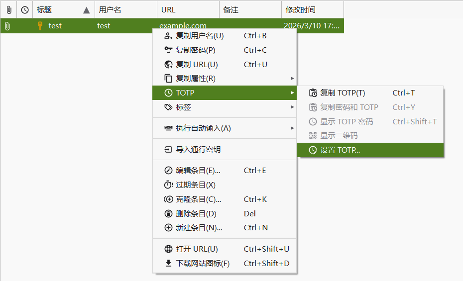
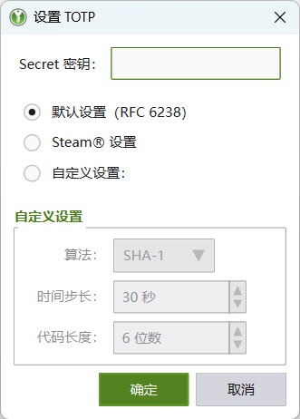

近来尝试了下keepass，有以下体验。

- 软件生态多，不统一
- 离线为主，无官方server端
- 密码库可选项多

## 生态多

以下仅列举知名keepass软件

- 桌面端：
  - [keepassXC](https://keepassxc.org/)：桌面端最好的keepass，支持win/mac/linux，并有浏览器插件，支持密钥
  - [keepass](https://keepass.info/)：官方的keepass，仅支持win
- 移动端
  - 安卓：
    - [keepassDX](https://www.keepassdx.com/)：完全离线，需配合其他软件/服务同步
    - [keepass2android](https://github.com/PhilippC/keepass2android)：自带webdav等云同步服务
    - 等等
  - ios：~~我不用ios，我无法评价~~
    - [strongbox](https://strongboxsafe.com/)
    - [keepassium](https://keepassium.com/)

em，近来keyguard也开始beta支持keepass了，值得期待

## 离线

有的是不带云同步（纯离线）、有的是带webdav等其他方式同步。

## 密码库可选项多

对于keepass密码库有很多可选项

- 密码库加密算法：
  - AES
  - Twofish
  - ChaCha20
- 主密钥KDF算法：
  - AES-KDF
  - Argon2d
  - Argon2id
- 数据库凭证：
  - 密码
  - 密钥文件
  - 质询响应

对于密码库版本主流有KDBX3和KDBX4两版本，无脑选后者即可。对于数据库加密算法没什么可说的，都很好。KDF算法选Argon2id即可。对于数据库凭证，三者都可以添加以保证安全性，其中密钥文件是任意一个文件即可，或者由keepassXC生成也行，必须保证内容不变，对于质询响应就是插入yubikey等物理密钥。

