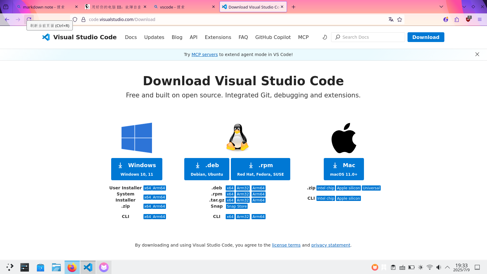
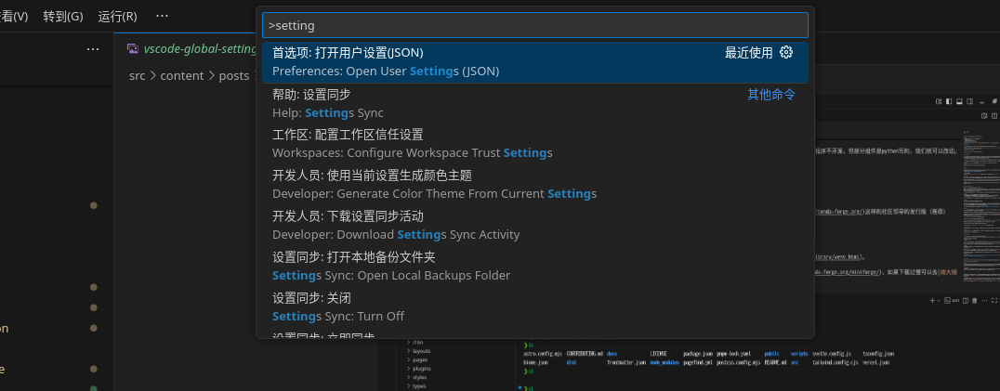
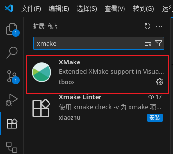
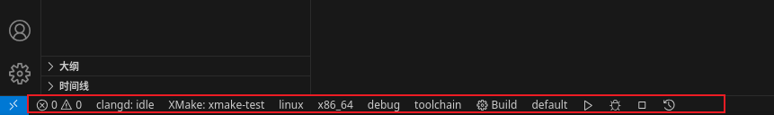
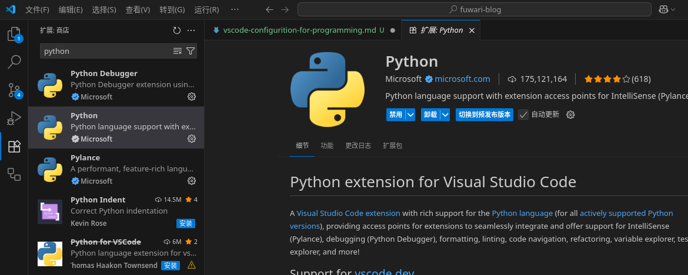

# 前言

vscode是一个著名的文本编辑器，深受程序员喜爱。

优点：
- 轻量化~~尤其相对于是VS,Pycharm这种重器~~
- 插件众多，主流选择
- 主要由微软维护 ~~不怕跑路~~
- 跨平台（win,mac,linux）上均可使用

本篇文章主要讲述vscode在c++和python开发上的配置。供记录自己的思路和为他人做参考。那么我们开始吧。由于作者主要使用debian和win系统，所以对mac少有提及。

# vscode下载

~~没想到这个也得教，因为xhs上总是有人进入了vscode的冒牌网站，然后说39.9元永久解锁~~

**vscode是免费的，官网是[https://code.visualstudio.com/](https://code.visualstudio.com/)** 然后根据你的系统选择你的下载格式，win就是.exe/msi，ubuntu/debian就是.deb，centos/rocky/fedora就是.rpm

~~mac我真没用过，原谅我。~~

:::note
vsc的全局设置setting.json可以这样打开

:::

# c/c++环境配置

## c/c++编译器

c++主流编译器/工具链有三家，[MSVC](https://visualstudio.microsoft.com/zh-hans/downloads/)、[GCC](https://gcc.gnu.org/)和[Clang](https://clang.llvm.org/)。其中MSVC是由[微软](https://learn.microsoft.com/zh-cn/cpp/?view=msvc-170)维护，GCC由[GNU](https://www.gnu.org/)维护，Clang由[LLVM](https://llvm.org/)维护。（在这里不区分GCC和gcc的区别，有想了解的可自行查阅）

~~其实c语言也是个老登了，直到近几月，[c语言官网](https://c-language.org)才出来，c语言发明时是1978年~~

使用MSVC就不多做讲解，因为[VS](https://visualstudio.microsoft.com/zh-hans/vs/)就是一个完善的IDE且内置MSVC，你只用选择下载c++环境就可以了，无需更多配置

如果你想在win上使用GCC/Clang那么你就要使用[mingw64](https://www.mingw-w64.org/)啦。

:::note
mingw64是有人将GCC/LLVM 工具链的代码迁移到win上的工具链，现在似乎推荐使用UCRT64了
:::

### 配置

- win:
去github上[下载](https://github.com/brechtsanders/winlibs_mingw/releases)别人预编译好的版本。如果网络不好，那么可以下载[南大镜像版](https://mirrors.nju.edu.cn/github-release/brechtsanders/winlibs_mingw/)
**记得将/mingw/bin目录添加到系统环境变量哦**

- ubuntu/debian:
直接`sudo apt install build-essential clang`就可以了。~~linux还是这么容易配置开发环境~~

## 语法高亮

因为vscode是一个文本编辑器，所以它无法为众多编程语言提供文本高亮以及文本补全等IDE必备功能，而是使用了LSP协议为这一功能进行了封装，使得其他人可以很方便的为vscode编写插件，让它拥有这样的功能。可以查看此网站来进一步了解[LSP](https://microsoft.github.io/language-server-protocol/)

你可以选用的高亮插件有两个，一个是ms开发的[C/C++插件](https://mirrors.nju.edu.cn/github-release/brechtsanders/winlibs_mingw/)，另一个是[clangd](https://github.com/clangd/vscode-clangd),你均可以在vscode插件商店里下载这两个插件。其中前者由微软维护，后者由LLVM组织维护。

:::tip
你当然可以去下载[CodeRunner](https://github.com/formulahendry/vscode-code-runner)或[codelldb](https://github.com/vadimcn/codelldb)这样的插件，以让你的vscode更像一个IDE
:::

## 构建工具/包管理

构建工具在多文件、依赖管理等方面起着重要作用。

因为c++缺少官方的包管理，也就意味着你不能像python里直接`pip install package_name`或者rust里`cargo add `来添加和下载依赖项。~~现代的语言都有包管理~~。但存在着[vcpkg](https://learn.microsoft.com/zh-cn/vcpkg/get_started/overview),[conan](https://conan.io/)这样的包管理器。使用包管理器你可以很方便的管理依赖包的版本，如常用的opengl和boost库等。

~~虽然C++20引入了module,但目前主流编译器（MSVC,GCC,Clang）支持不完善，MSVC的支持相对完善些。但这个特性不太常用~~

:::note
（举手）诶，等一下，要是包管理的仓库里没有我要的包怎么办呢？
- 这里就要引入构建工具了。你将会手动下载所需的库、设置查找库的目录和设置链接库的名字。
- 为这个库打包并上传至官方包管理仓库，以后你就可以很轻松的install此库了。

在c++里，你将会自己下载第三方的库（静态库、动态库和头文件等），熟悉可执行文件生成的过程（预处理、编译、链接）。
:::

:::note
其实编译器做的就是将源代码翻译成汇编或机器码。
:::

常见的构建工具有[make](https://www.gnu.org/software/make/),[cmake](https://cmake.org/),[xmake](https://xmake.io)等。`make`相当古老且且仅适用于linux平台。cmake应该被叫做构建工具的“构建工具”，因为使用cmake可以生成多种工具链的配置，而你只需编写一遍cmake的配置文件，就可以生成出适用于MSVC+vcpkg或GCC/Clang+make/ninja的配置，之后你就可以使用VS打开生成的工程文件或者在命令行上make就可以编译运行了。

不过我这里主要谈xmake配置、使用，哈哈。**xmake既可以当包管理来用，也可以当构建工具用。**

### xmake

为什么是xmake呢？xmake相比于cmake有什么优势呢？语法较简洁，目前较为先进的构建系统，对于小项目开发很友好。[xmake](https://github.com/xmake-io/xmake)是国人一位大牛制作的，已经在github上斩获上万star。

安装xmake：[官网安装教程](https://xmake.io/guide/quick-start.html#installation),其中主要是用官方脚本或包管理器安装。

官网中有着命令行教程来[创建工程](https://xmake.io/guide/quick-start.html#create-project)、[编译程序](https://xmake.io/guide/quick-start.html#build-project)、[运行程序](https://xmake.io/guide/quick-start.html#run-program)、[调试程序](https://xmake.io/guide/quick-start.html#debug-program)的教程，可以跟着做做。

**安装xmake的vscode的插件**：去vscode插件商店下载哦。

新建一个空文件夹，然后用vscode打开此文件夹，在vscode的命令面板里输入`> xmake: create project`，然后你就可以选择使用的语言及工程类型了

之后你就能看到哇，可以用点点点来选择你的编译工具链、目标架构平台等详细信息了。

**xmake的相关语法可以在[官网](https://xmake.io)查询** ~~我就不教了（狡黠）~~

:::note
在vscode里会出现高亮不对（找不到头文件在哪的报错），请查看[xmake configuration intellsence](https://xmake.io/guide/extensions/ide-integration-plugins.html#configure-intellsence)来配置vscode
:::

# python环境配置

python最好的就是它包多，科学计算的人在用，数据分析的人在用，后端框架也有。并且也有方便的包管理工具，如`pip`和`conda`。

:::note
由于python是解释性语言，无需编译即可运行，也就意味着只要把编写的程序发布就相当于发放了源代码。有些程序不开源，但部分组件是python写的，我们就可以改动。

~~没错没错，c/cpp和rust就是编译性语言~~
:::

## 下载python

- 在[官网](https://www.python.org/downloads/)下载python
- 下载[anaconda/miniconda](https://www.anaconda.com/download)等商业发行版或者是[miniforge](https://conda-forge.org/)这样的社区领导的发行版（推荐）

管理python环境包的方法主要有两种
- 虚拟环境(venv)
- conda

虚拟环境是python官方提供的一个管理依赖项目的工具，详情可查看[官方文档](https://docs.python.org/3/library/venv.html)。

你可以选择anaconda、miniconda、miniforge等来配置你的conda环境。这里推荐使用[miniforge](https://conda-forge.org/miniforge/)，如果下载过慢可以去[南大镜像站下载](https://mirrors.nju.edu.cn/github-release/conda-forge/miniforge/)

:::note
anaconda 由于包含了许多常用包，导致很重，约1GB，而miniforge和miniconda则较小，约100MB。而miniforge所携带的`mamba`则比`conda`性能更高，且你同样也可以使用conda的命令。
:::

如果要在win上使用anaconda最好把环境变量配置一下，不然在终端里敲击conda，win是找不到conda在哪的，详情可参照此[配置](https://blog.csdn.net/qq_41027003/article/details/111242841)。然后在anaconda propmt里输入`conda init`即可完成配置。

在linux的终端里，根据你所使用的终端的不同，你要执行如下命令完成配置：`~/miniforge3/bin/conda init zsh` (我的终端是`zsh`,你应该将此处替换为你所使用的终端，如`fish` `bash`等)

:::important
**我们在完成上述配置后一定要对pypi和conda进行换源，因为python在你在你命令`pip install package`后，会向某服务器下载你要的包，默认是python官方的服务器（国外），为了高速下载包请自己换源至国内高校镜像站**
:::

## 插件配置

请下载[ms-python](https://github.com/Microsoft/vscode-python),之后你的python代码就有高亮和代码提示了，好诶。

:::note
注：其实高亮是pylance带来的。这个插件名义上是开源的，但在codium上已经不能使用了，能使用的最高版本是[2023.6.40](https://marketplace.visualstudio.com/_apis/public/gallery/publishers/ms-python/vsextensions/vscode-pylance/2023.6.40/vspackage)，详情可以观看这个[讨论](https://stackoverflow.com/questions/75345501/make-python-code-highlighting-for-vscodium-equal-to-vscode)
:::

:::important
[清华大学镜像站](https://mirrors.tuna.tsinghua.edu.cn/),[中国科学技术大学镜像站](https://mirrors.ustc.edu.cn/),[南京大学镜像站](https://mirror.nju.edu.cn/)，这些镜像站可以方便国外常用软件的下载和换源，以及linux的下载和换源。
:::

# 结

vscode号称一个code写天下，你基本只用配置插件即可。对我来说，因为我的主系统是debian+win，我有跨平台的要求，所以选择了vscode。如果只在win上开发，你当然可以选择“宇宙第一IDE”VS。至于其他的文本编辑器如vim,emacs等就靠读者自己探索吧。~~因为我主力是code，vim主要用于在命令行里编辑文件（linux自带vi和nano），emacs用的少~~

:::note
微软开源的文本编辑器 [`code oss`](https://github.com/microsoft/vscode)，而vscode是基于此项目的微软独有软件。如果你在win上安装vscode的时候就会注意到其软件许可证是[`MICROSOFT SOFTWARE LICENSE`](https://code.visualstudio.com/license)，而不是code-oss的[MIT协议](https://opensource.org/license/MIT).

由上述开源仓库编译的产物被称作`codium`，vscode被称作`code`。codium的官网是[https://vscodium.com/](https://vscodium.com/)。
:::